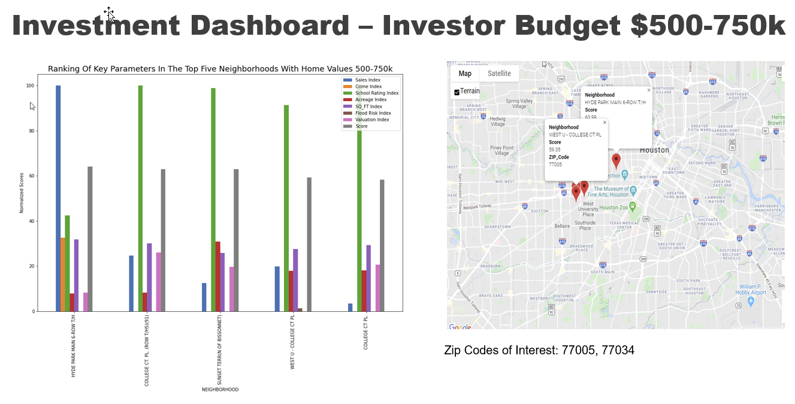
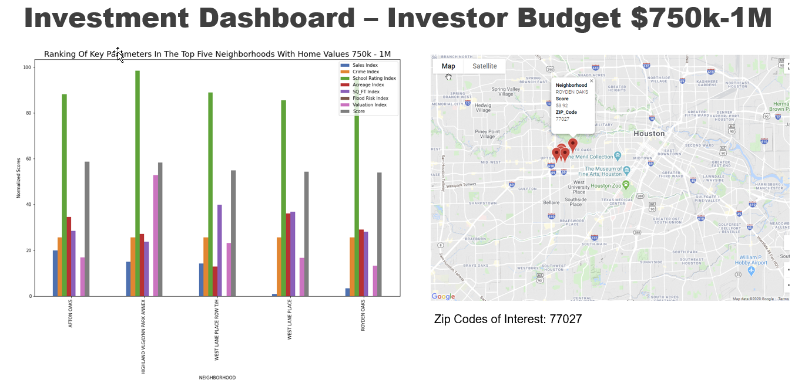

# Houston Real Estate Investment Scorecard

## Motivation & Summary
### The Problem
Real Estate Investment opportunities require extensive research and Investors spend hours searching for best places to invest in Houston. Multiple apps are available for single properties, not for neighborhood trends. Access to large datasets is expensive and data analysis is time consuming for general public.

### The Question
What are the best neighborhoods to invest in Single Family Homes in Houston?

### The Solution
* Analysis of 8 parameters by neighborhood in selected Zip Codes
* Ranking of neighborhoods depending on investor budget

## Target Area
The focus of the study are Single Family Homes in 9 ZIP codes in the Houston area that are located in the inner loop between I-10, 610, and 288 highways.
The 9 ZIP Codes of study are: 77002,77005,77006, 77019,77025, 77030, 77054, 77027, 77098.

## Data Sources & File Management
The following are the data sources used:
* HCAD System: https://pdata.hcad.org/download/2019
* School Ratings: https://texasschoolguide.org/school-rankings/
* National Flood Data: http://nationalflooddata.com/flood/floodapi/
* Places:https://cloud.google.com/maps-platform/
* Crime: https://www.houstontx.gov/police/cs/Monthly_Crime_Data_by_Street_and_Police_Beat.htm

All related files to this project are located at: https://drive.google.com/drive/folders/1vn9j-N2DYTr-BGjgSgRSi1-WDZ3dmUnE.
Input files could not be pushed to GitHub because their individual sizes exceed 100MB.

## Data Gathering & Cleanup

Code:HCAD_Data_Processing.ipynb
    This notebook pulls in data from several Harris County Appraisal District files, appends them and filters them down to the necessary parameters, zip codes and to only single family residential addresses.
    The input files required to run HCAD Data Processing notebook are in the google drive specified above, the files are:
        'Resources/2018 files.zip'
        'Resources/2019 files.zip'
        'Resources/building_res.zip'
        'Resources/real_neighborhood_code.txt'
    The output file from this notebook is: 
        'Output/Inner_Loop_18_19.csv'
    This file is then used as an input to the Get_Flood_API notebook
            
Code:Get_Flood_API.ipynb:
    This notebook pulls flood information from the national flood api on every address in our HCAD dataset (when available).
    The input file required to run the Get_Flood_API is:
        'Resources/Inner_Loop_18_19.csv'
            To run this file you will either have to borrow Adriana's API key or get your own and create a file called 'api_keys' with the line of code: flood_data_api_key = 'YOUR API KEY HERE'
    The file will create an output file for each zip code:
        'Output/flood_data_{zipcodes}.csv'           

Code:flood_api_pull_missing_addresses.ipynb
    We initially had an error that missed some addresses,determined which they were and then had to pull them to a new batch of Flood API pulls.
    The file required to run this notebook is:
        'Resources/missing_addresses.csv'
    For this file you will need an API key and file called 'api_keys' with the line of code: lood_data_api_key = 'YOUR API KEY HERE'
    This will create many output files:
        'Output/flood_data_batch{x}.csv'
    
Code:Combine_Flood_Crime_HCAD.ipynb
    This file pulls the houston crime data, aggregates is by zip code, indexes it and appends it to the flood and HCAD data.
    The input file required to run the Get_Flood_API are:
        'Resources/flood_data_{z}.csv'
        'Resources/flood_data_batch{x}.csv'
        'Resources/Inner_Loop_18_19.csv'
     Note:  This notebook has a commented out section that shows the code that was used to determine the addresses that we were initially missing before running the missing addresses notebook listed above.
     The output of this notebook was:
         'Output/flood_crime_hcad.csv'

Code: school_ratings.ipynb
    This notebook pulls school ratings and types of schools and geolocates each school on its address to get its latitude and longitude.
    This code also contains the steps used to clean up the school ratings dataset
    The inputs required for this notebook include:
        'Resources/tsg_final_11.17_From_Children_at_Risk.csv'
    You will need a google maps api key to run this notebook.  You should store it in a file called 'config' and include the line of code gkey = "YOUR API KEY HERE".
    The output created by this notebook is:
        'Output/Schools_Ratings_Harris_Co.csv'
        
Code: merging_owner_data.ipyng
    This notebook merges owner data and sales year into the main dataframe
    Input Files: Resources/new_owner.csv, Resources/combined_data_without_charter_schools.csv. Output Files: Output/all_data_merged.csv

## Data Analysis
Code: school_data_exploration.ipynb, Input Files:Resources/combined_flood_crime_and_school_data.csv, Resources/Schools_Ratings_Harris_Co.csv. Output file: Output/combined_data_without_charter_schools.csv

This code shows the plots and correlations done on key parameters

Code: crime_chisquare.ipynb, Input Files:Resources/combined_flood_crime_and_school_data.csv

This code shows the chi_square analysis of crime by zip code.

Code: school_zone_classification.ipynb, Input Files:Resources/Schools_Ratings_Harris_Co.csv, Resources/flood_crime_hcad.csv. Output file: Output/combined_flood_crime_and_school_data.csv
        
This code shows the sklearn KNearest Neighboor test used to do a pseudo school zoning per residence in the dataset

Code: BoxPlots.ipynb, Input Files: Resources/all_data_merged.csv

This code produces all the boxplots for the parameters of study

## Investment Dashboard
Code: Results.ipynb, Input Files: Resources/all_data_merged.csv, Output Files: Output/homes_less_than_1M.csv

This code computes and summarizes the investment ranking by Neighborhoods in selected ZIP codes.

### Methodology
7 parameters were chosen to rank the best neighborhoods to invest depending on budget: 
* Sales: number of sales in 2019 in a given neighborhood
* Crime Rate: number of crimes in a given ZIP Code
* School Rating:	Average school rating for public elementary, middle and high-schools
* Acreage: 	Land area of the properties
* SQ_FT: 	House area in sqt
* Flood Risk:	Risk of flooding
* Valuation: Increase/ Decrease on home valuation year over year (2018-2019) 

A correlation matrix was built for the above parameters and the appraised value 2019 of Single Family homes. Appaised value correlated fairly well with home area and land area as expected.
The other parameters have no correlation against the others, meaning that they are no linear relationships between those variables.

To rank the neighborhoods,the following is the procedure used on homes valued less than $1MM
* 1- Sales, Crime Rate, School Rating, Acreage, SQ_FT, Flood Risk, where normalized first using the equation: Xn=(X-Xmin)/(Xmax-Xmin).
Where,  Xn= Normalized parameter
        X= Value of the parameter
        Xmin= minimum value of the parameter
        Xmax= maximum value of the parameter
* 2- Valuation can take negative numbers, so Vn=V/Vmax
Where,  Vn=normalized valuation
        V= valuation
        Vmax = maximum valuation
* 3-  Weights for each parameter can be left at 1 as base case (all parameters equal) or can be defined based on user needs: How important each parameter is for the investor. Investor should rank parameters from 0 to 10, 
    0 meaning not important, 10 meaning very important
    For this example, we used:
    * Sales: 8
    * Crime Rate: 5
    * School Rating:	7
    * Acreage: 	6
    * SQ_FT: 	6
    * Flood Risk:	8
    * Valuation: 10
* 4- A score is defined based on the weights and the normalized parameters:
    Score: Wsales*Sales_norm + Wschools*School_norm + WAcreage*Acreage_norm + WSQ-FT * SQFT_norm + Wvaluation*Valuation_norm-W + Crime*Crime_norm - WFlood*Flood_norm
    Score is then normalized to have a range 0-100.
* 5-  Results are grouped by neighborhood, and neighborhoods that have negative valuation or no sales are removed.
* 6-  Valuation is normalized so score falls into 0-100 range.
* 7-  Results of top neighborhoods to invest given parameter importance and budget are presented, along with the map of where the neighborhoods are.

### Results
The graphs below are the results of the study area with given weights for the paameters by an Investor. Different weights will rank neighborhoods differently.
The grapsh below are an example o the results produced based on the weights of the parameters presented above.

#### Investor Scorecard for all area of study

#### Investor Scorecard for budget $0-250k

#### Investor Scorecard for budget $250-500k   

#### Investor Scorecard for budget $500-750k  

#### Investor Scorecard for budget $750k-1M  

